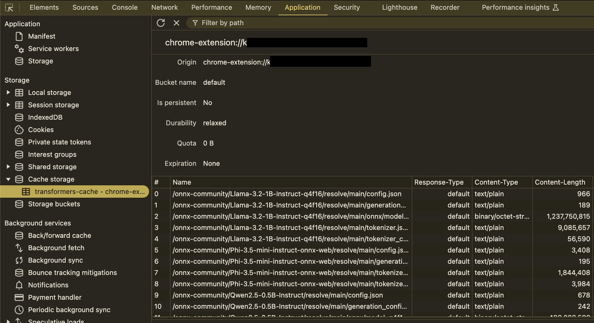

# Transformers.js Chrome Extension

This is an example Chrome extension for [Transformers.js](https://github.com/huggingface/transformers.js), a library for running LLMs in the browser, built on top of [Plasmo](https://plasmo.com/).

Please note that this project is still under development. The chrome extension process could be stopped by the browser anytime. Please refer to the [tantara/transformers.js-chrome](https://github.com/tantara/transformers.js-chrome) repo for the latest updates.

## Examples

Here is the link to the [demo video](https://www.youtube.com/watch?v=yXZQ8FHtSes). Each example will be updated below.

| Task               | Example                                                                                                |
| ------------------ | ------------------------------------------------------------------------------------------------------ |
| Text Summarization |                                             |
| Code Generation    |                                               |
| Multi Modal LLM    | [https://github.com/tantara/transformers.js-chrome](https://github.com/tantara/transformers.js-chrome) |
| Speech to Text     | [https://github.com/tantara/transformers.js-chrome](https://github.com/tantara/transformers.js-chrome) |
| Reasoning          | [https://github.com/tantara/transformers.js-chrome](https://github.com/tantara/transformers.js-chrome) |
| Image Generation   | [https://github.com/tantara/transformers.js-chrome](https://github.com/tantara/transformers.js-chrome) |

## Features

- [x] Integrate Transformers.js with Chrome extension
- [x] Use modern web development tooling (TypeScript, Parcel, Tailwind CSS, Shadcn, etc.)
- [x] Change generation parameters (e.g. max_tokens, temperature, top_p etc.)
- [x] Load LLaMA variants
- [x] Load other LLM models
- [x] Release extension to Chrome Web Store

## Performance

All the numbers below are measured on a MacBook Pro M1 Max with 32GB RAM.

Prompt: "Write python code to compute the nth fibonacci number."

| Model                                                                                           | Throughput      |
| ----------------------------------------------------------------------------------------------- | --------------- |
| [Llama-3.2-1B](https://huggingface.co/onnx-community/Llama-3.2-1B-Instruct-q4f16) (q4f16)       | 40.3 tokens/sec |
| [Phi-3.5-mini](https://huggingface.co/onnx-community/Phi-3.5-mini-instruct-onnx-web) (q4f16)    | 32.9 tokens/sec |
| [SmolLM2-1.7B](https://huggingface.co/HuggingFaceTB/SmolLM2-1.7B-Instruct) (q4f16)              | 46.2 tokens/sec |
| [Qwen2.5-Coder-1.5B](https://huggingface.co/onnx-community/Qwen2.5-Coder-1.5B-Instruct) (q4f16) | 36.1 tokens/sec |


## Installation

### Chrome Web Store

Install '[Private AI Assistant[(https://chromewebstore.google.com/detail/private-ai-assistant-runn/jojlpeliekadmokfnikappfadbjiaghp)]' from the Chrome Web Store.

### From source

You should install `node` and `pnpm` to build the project.

First, install the dependencies:

```bash
pnpm install
```

Then, start the development server:

```bash
pnpm dev
```

Open your Chrome browser (i.e. `chrome://extensions`) and load the appropriate development build. For example, if you are developing for the chrome browser, using manifest v3, use: `build/chrome-mv3-dev`.

For further guidance, [visit Plasmo's Documentation](https://docs.plasmo.com/) or create an issue.

## Deployment

### Making production build

Run the following:

```bash
pnpm build
```

This should create a production bundle for your extension, ready to be zipped and published to the stores.

### Submit to the webstores

The easiest way to deploy your Plasmo extension is to use the built-in [bpp](https://bpp.browser.market) GitHub action. Prior to using this action however, make sure to build your extension and upload the first version to the store to establish the basic credentials. Then, simply follow [this setup instruction](https://docs.plasmo.com/framework/workflows/submit) and you should be on your way for automated submission!

## Debugging

### Debug service worker

Open `chrome://extensions` and find the "Inspect views" section for the extension.


### Memory usage for inference

Open Chrome > More Tools > Task Manager.


### Local storage for cached checkpoints

Run Chrome extension, open `inspect`, go to `Application` tab, find `Local Storage` section, and find the `transformers-cache` entry.



## References

- [Transformers.js Example](https://github.com/huggingface/transformers.js-examples)
- [Transformers.js V2 Chrome Extension](https://github.com/huggingface/transformers.js/tree/main/examples/extension)
- [Plasmo Documentation](https://docs.plasmo.com/)
- [WebLLM](https://webllm.mlc.ai/) and its [Chrome Extension](https://github.com/mlc-ai/web-llm/tree/main/examples/chrome-extension-webgpu-service-worker)
- [gpu.cpp](https://github.com/AnswerDotAI/gpu.cpp)
- https://github.com/huggingface/transformers.js/issues/986
- https://github.com/microsoft/onnxruntime/issues/20876
- https://github.com/ggaabe/extension
