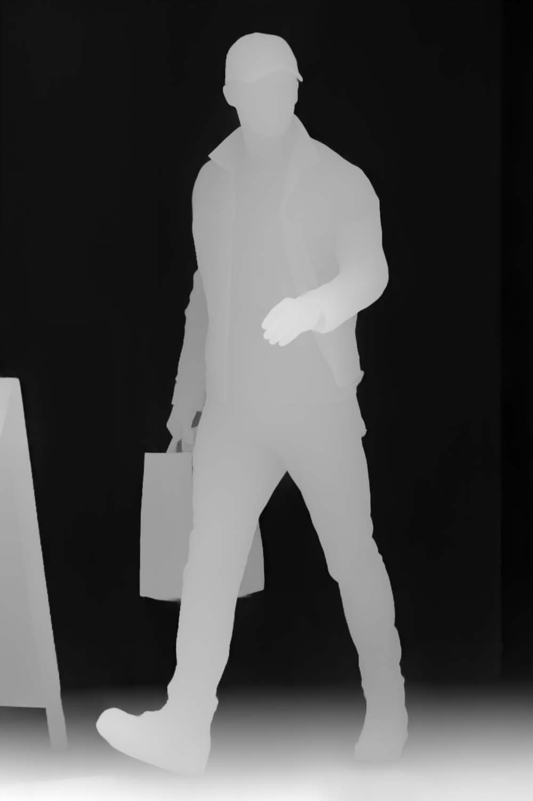

# depth-pro-node

This project demonstrates how to use [Depth Pro](https://github.com/apple/ml-depth-pro), foundation model for zero-shot metric monocular depth estimation, in a Node.js environment.

## Instructions

1. Clone the repository:
   ```sh
   git clone https://github.com/huggingface/transformers.js-examples.git
   ```
2. Change directory to the `depth-pro-node` project:
   ```sh
   cd transformers.js-examples/depth-pro-node
   ```
3. Install the dependencies:
   ```sh
   npm install
   ```
4. Run the example:
   ```sh
   node index.js
   ```

## Results

The following images illustrate the input image and its corresponding depth map generated by the model:

| Input Image                        | Depth Map                        |
| ---------------------------------- | -------------------------------- |
|  |  |
