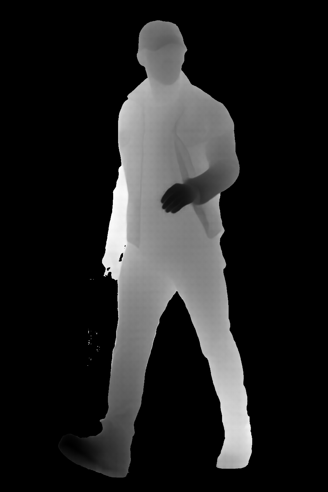

# sapiens-node

This project demonstrates how to use [Sapiens](https://github.com/facebookresearch/sapiens), a foundation model for human tasks (segmentation, depth, and normal estimation) in a Node.js environment.

## Instructions

1. Clone the repository:
   ```sh
   git clone https://github.com/huggingface/transformers.js-examples.git
   ```
2. Change directory to the `sapiens-node` project:
   ```sh
   cd transformers.js-examples/sapiens-node
   ```
3. Install the dependencies:
   ```sh
   npm install
   ```
4. Run the example:
   ```sh
   node index.js
   ```

## Results

The following images illustrate the input image, its corresponding depth map, and the normal map generated by the model:

| Input Image                        | Depth Map                        | Normal Map                         |
| ---------------------------------- | -------------------------------- | ---------------------------------- |
|  |  |  |
